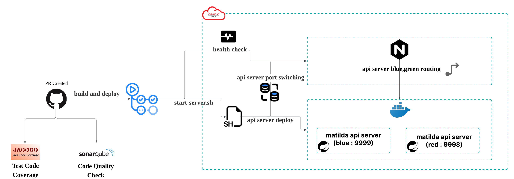

# what is this?

[matilda](https://matilda.woowacourse.com/)

# 핵심 가치

- 매일매일 대충 쓰여지고 사라지는 TIL이 아닌 쌓일수록 유의미해지는 TIL 작성 경험 제공
- 주변 크루들의 학습 관심사를 쉽게 파악가능

# 인프라

## cicd

- 모니터링(prometheus + grafana)
- 무중단배포(nginx)
- ci/cd(github action)
- 컨테이너 단위 관리(docker)
- 코드 품질(SonarCloud)
- 테스트 코드 품질(Jacoco)
- 외부 api
    - openai api
    - slack api
    - github api

# 핵심 기능

- MarkDown 기반 TIL 생성
- AI 기반 자동 태그 추출
- 필터별 TIL 조회
- 다른 크루 TIL 북마크
- 작성된 TIl 내용의 레퍼런스 제공
- 태그 기반 검색 기능
- 최근 작성된 TIL 통계
- 외부에 TIL 공유 기능(슬랙, 연동 등)

# changelog
[CHANGELOG](https://github.com/TilGuy/BE_TilGuy/blob/main/Changelog.md)
# collaborators

- 투다
- 비타
- 몽이
